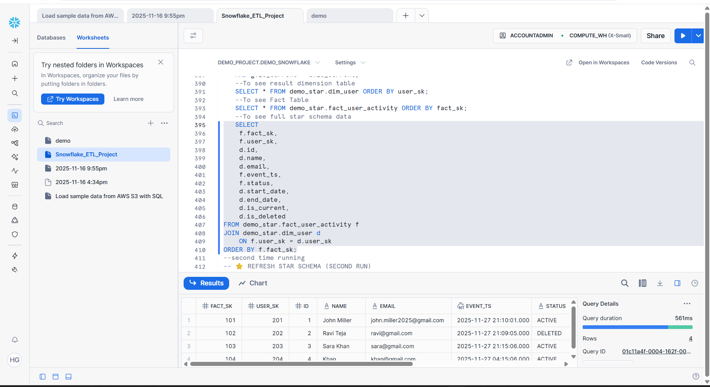
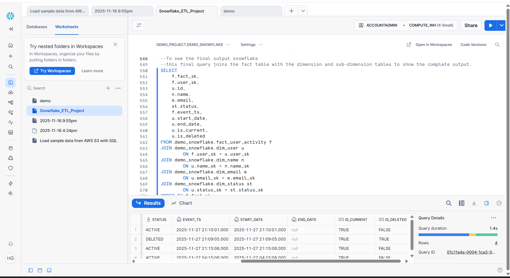
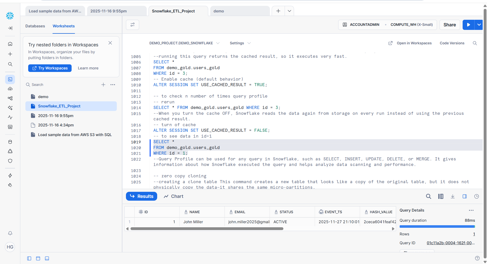

End-to-End Snowflake Data Pipeline
RAW–SILVER–GOLD | SCD-2 | Time Travel | Fail-safe | Views | Materialized Views | Query Profile | Zero-Copy Cloning

-- RAW Layer

The RAW layer captures source data exactly as received in JSON format, preserving full history for auditing, reprocessing, and downstream incremental processing.

-- SILVER Layer

In this step, I build the SILVER layer by transforming semi-structured RAW JSON data into clean, typed columns. I deduplicate records using a ROW_NUMBER window function based on the business key and load timestamp, ensuring only the latest version of each record is retained. The table is rebuilt using CREATE OR REPLACE, making the pipeline idempotent, re-runnable, and reliable for downstream analytics.

-- GOLD Layer

So, basically, the GOLD layer is the final business-ready layer where clean and trusted data is stored for analytics. In this layer, I use SCD Type-2 logic to track historical changes instead of overwriting records. To efficiently detect real data changes, I generate a hash value on key attributes and apply MERGE logic. This approach makes the pipeline idempotent, fully auditable, and safe to re-run for reporting and analytics.

-- Views & Materialized Views

So, basically, a view provides a logical layer on top of the GOLD table and always reads the latest data from the base table. It does not store data physically and is mainly used to simplify queries and control access. A materialized view, on the other hand, physically stores query results to improve performance for frequent or heavy queries. Overall, views are used for flexibility and materialized views for performance optimization.

-- STAR Schema

So, basically, in the STAR schema, I design a denormalized model with a central fact table and surrounding dimension tables derived from the GOLD layer. This structure simplifies joins, improves query performance, and is optimized for reporting and BI workloads. The STAR schema is refreshed in a controlled and re-runnable manner to maintain consistency.

-- Snowflake Schema

So, basically, the Snowflake schema further normalizes the STAR schema by splitting dimensions into sub-dimensions such as name, email, and status. This reduces data redundancy and improves dimension maintainability while still supporting analytical queries. It demonstrates advanced dimensional modeling aligned with enterprise data warehouse standards.

-- Time Travel (Statement ID & Timestamp)

So, basically, this section demonstrates how Snowflake Time Travel is used to recover data that was accidentally deleted or modified. I use both statement-ID-based and timestamp-based queries to view data as it existed at a specific point in time. This helps in rolling back changes and auditing data without relying on backups or physical data copies. Overall, it shows Snowflake’s built-in data protection within the configured retention period.

-- Fail-safe

So, basically, Fail-safe is Snowflake’s last-resort data recovery layer that comes into play after the Time Travel retention period ends. It is mainly used for disaster recovery and can only be accessed through Snowflake Support.

-- Zero-Copy Cloning

So, basically, Zero-Copy Cloning creates an instant snapshot of a table without physically copying data. Any changes made to the source table after cloning do not impact the clone, making it ideal for testing, validation, and recovery scenarios.

-- Query Profile & Performance

So, basically, Query Profile helps analyze how much data is scanned and how efficiently Snowflake executes a query. When result caching is enabled, repeated queries return instantly with zero data scanned, significantly improving performance. When caching is disabled, Snowflake reads data again from storage, increasing both data scanned and execution time. Overall, Query Profile helps understand performance, data pruning, and cost impact.

