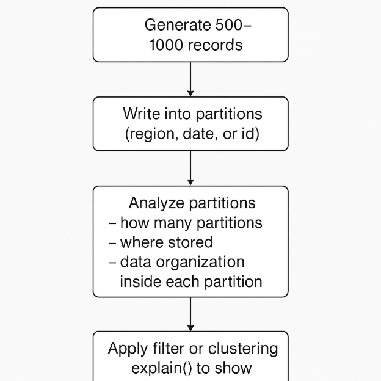

`                                                 **Spark Data Partitioning and Optimization**

**Partitioning** means dividing large data into smaller parts, like by month or region. So Spark or any other system reads only the required part instead of scanning the entire data. This process is called partitioning.
**clustering:** Clustering also works the same way in any cloud. We use clustering to improve query performance and speed. It helps the system read only the specific part of data we need instead of scanning everything. By doing clustering, we can improve query speed and reduce cost.

**partitioning and clustering** work the same way in all clouds.only the tool names and terms different.
**AWS** → Partitioning in S3, Clustering in Redshift or Athena. 
**Azure** → Partitioning in Synapse, Clustering (or indexing) in Databricks or SQL.
**GCP** → Partitioned and Clustered tables in BigQuery. 
**Snowflake** → Partitioning happens automatically using micro-partitions, and clustering can be managed manually with cluster keys to improve query performance.\
In Snowflake, each micro-partition is about 16 MB uncompressed

**Task:**
Generate around 500–1000 records and write them into partitions (like by region, date, or id). Then analyze how many partitions Spark created, where they are stored, and how the data is organized inside each partition (physically).

Basically showing how Spark stores, organizes, and optimizes data using partitions, and how it improves performance when you run queries with filters or clustering.

**Step 1:** Generate 500 to 1000 records.
**Step 2:** Write the data into partitions (for example, by region, date, or ID).
**Step 3:** Use Spark to explain how many partitions are created, where the data is stored, and how it is organized inside each partition.
**Step 4:** Apply a filter or clustering. (Clustering improves speed and helps retrieve specific information from the required partition.)

**code explanation:**
This code (generate\_data.py) generates 1000 random records and stores them as data.csv in the same folder where the Python script is running.

**code:**
This partition.demo code reads the CSV file in Spark, partitions data by month using Pandas, and stores those partitions in the same folder where the Python code runs. Finally, it prints a success message.
**code:**

This code reads all partitioned CSV files and combines them. It shows the total number of records and displays how many partitions are saved and in which folders the data is stored.

**Code:**\
This code filter\_clustering displays information for filtering and clustering. The filter displays data for a specific month, and the cluster combines that data by region to make it faster and more efficient. It also shows the before and after clustering results.

